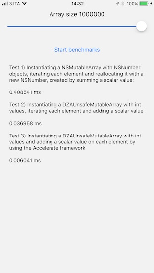

# DZAUnsafeMutableArray

[](https://travis-ci.org/Davide Di Stefano/DZAUnsafeMutableArray)
[](http://cocoapods.org/pods/DZAUnsafeMutableArray)
[](http://cocoapods.org/pods/DZAUnsafeMutableArray)
[](http://cocoapods.org/pods/DZAUnsafeMutableArray)

## What is this for

This class is an Objective-C wrapper around a c auto-growing pointer array.

I built this library because I'm rewriting [RouletteBetter](https://itunes.apple.com/us/app/roulettebetter-odds-calculator-betting-strategies-for/id310598685?mt=8) and I wanted a way to make *lot* of statistics calculation on vectors. To do so, we can use the [iOS Accelerate framework](https://developer.apple.com/documentation/accelerate) to 'Make large-scale mathematical computations and image calculations, optimized for high performance'. Unfortunately the Accelerate framework wants basic c pointer array as input/output parameters, so we can't use NSMutableArray or high level NSObjects.

With this wrapper library, we can easily create and manupulate the c pointer array as an high level object and, whenewer we need it, access the low level pointer property (for example to pass it to the Accelerate framework c functions).

## Example

To run the example project, clone the repo, and run `pod install` from the Example directory first.

Example usage:

    // create and fill the array as an high level object
    DZAUnsafeMutableArray * unsafeArray = [[DZAUnsafeMutableArray alloc] initWithCapacity:10];
    for (int i = 0; i < 10; i++)
    {
        [unsafeArray addInt:i];
    }

    // access an element of the array
    int element = [unsafeArray intAtIndex:3];
    // remove the last object
    [unsafeArray removeLastObject];
    // shrink the array to the new size
    [unsafeArray shrinkToSize:5];
    // low-level access to the c pointer array with Accelerate framework:
    // sums a scalar to the entire vector
    int scalar = 3;
    vDSP_vsaddi(unsafeArray.intUnsafePointer, 1, &scalar, unsafeArray.intUnsafePointer, 1, unsafeArray.count);

A small benchmark app is included:




## Requirements

## Installation

DZAUnsafeMutableArray is available through [CocoaPods](http://cocoapods.org). To install
it, simply add the following line to your Podfile:

```ruby
pod "DZAUnsafeMutableArray"
```

## Author

Davide Di Stefano, dzamirro@gmail.com

## License

DZAUnsafeMutableArray is available under the MIT license. See the LICENSE file for more info.
